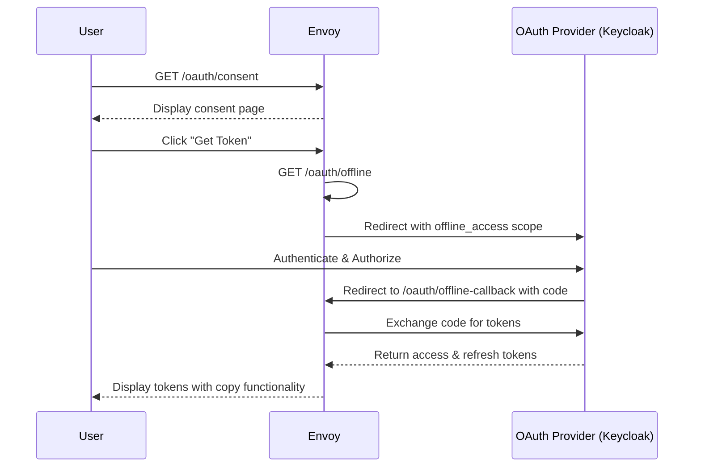

# Offline Token API Documentation

## Overview

The Offline Token API provides a secure way to obtain long-lived refresh tokens for API access without requiring browser-based authentication. This feature is useful for:

- Automated scripts and CI/CD pipelines
- Command-line tools
- Background services
- API integrations

## Endpoints

### 1. Consent Page
**URL**: `/oauth/consent`
**Method**: `GET`
**Description**: Displays a consent page explaining offline tokens and providing a "Get Token" button.

### 2. Offline Auth Redirect
**URL**: `/oauth/offline`
**Method**: `GET`
**Description**: Initiates the OAuth flow with `offline_access` scope to obtain a refresh token.

### 3. Offline Callback
**URL**: `/oauth/offline-callback`
**Method**: `GET`
**Description**: Handles the OAuth callback and displays the obtained tokens.

## Flow Sequence



## Configuration

### Enabling the Feature

The API key generation feature is disabled by default. To enable it, add the following to your Envoy configuration:

```yaml
typed_config:
  "@type": type.googleapis.com/envoy.extensions.filters.http.golang.v3.Config
  plugin_name: go-envoy-oauth
  plugin_config:
    "@type": type.googleapis.com/xds.type.v3.TypedStruct
    value:
      issuer_url: "https://your-oauth-provider/realms/your-realm"
      client_id: "your-client-id"
      client_secret: "your-client-secret"
      redirect_url: "/oauth/callback"
      enable_api_key: true  # Enable API key generation feature
```

### OAuth Provider Setup (Keycloak Example)

1. **Enable offline_access scope** in your client configuration
2. **Set Valid Redirect URIs** to include:
   - `https://your-domain/oauth/offline-callback`
   - `http://localhost:8081/oauth/offline-callback` (for local testing)

### Envoy Configuration

The API key generation feature must be explicitly enabled in the configuration:

- Set `enable_api_key: true` to enable the feature
- Set `enable_api_key: false` or omit the parameter to disable (default)

When disabled, all API key endpoints (`/oauth/consent`, `/oauth/offline`, `/oauth/offline-callback`) will return a 404 error.

## Usage

### 1. Obtaining an Offline Token

1. Navigate to `https://your-domain/oauth/consent`
2. Read the security information
3. Click "Get Offline Token"
4. Authenticate with your OAuth provider
5. Copy the refresh token from the display page

### 2. Using the Refresh Token

Exchange the refresh token for an access token:

```bash
curl -X POST https://your-oauth-provider/token \
  -H "Content-Type: application/x-www-form-urlencoded" \
  -d "grant_type=refresh_token" \
  -d "refresh_token=YOUR_REFRESH_TOKEN" \
  -d "client_id=YOUR_CLIENT_ID" \
  -d "client_secret=YOUR_CLIENT_SECRET"
```

### 3. Using the Access Token

Include the access token in API requests:

```bash
curl -H "Authorization: Bearer YOUR_ACCESS_TOKEN" \
  https://your-api-endpoint/resource
```

## Security Considerations

1. **Secure Storage**: Store refresh tokens securely:
   - Use encrypted storage for production environments
   - Never commit tokens to version control
   - Rotate tokens regularly

2. **Token Lifetime**: Configure appropriate token lifetimes in your OAuth provider:
   - Refresh tokens should have a reasonable expiration (e.g., 30-90 days)
   - Consider implementing token rotation

3. **Scope Limitations**: Only request necessary scopes for offline access

4. **Audit Logging**: Monitor offline token usage for security purposes

## Features

### Consent Screen
- Clear explanation of offline tokens
- Security warnings
- Modern, responsive UI
- One-click authorization

### Token Display Page
- Secure one-time display
- Copy to clipboard functionality
- Download as file option
- No-cache headers to prevent browser storage
- Separate display for refresh and access tokens

## Troubleshooting

### No Refresh Token Received

**Issue**: The token display page shows "Failed to obtain refresh token"

**Solutions**:
1. Verify `offline_access` scope is enabled in OAuth provider
2. Check client configuration allows refresh tokens
3. Ensure the redirect URL matches exactly

### Invalid State Error

**Issue**: "Invalid or expired state parameter" error

**Solution**: The OAuth flow timed out (5-minute limit). Start the process again.

### Token Copy Not Working

**Issue**: Copy button doesn't work

**Solution**:
- Try the fallback method (select text manually)
- Use the "Download as File" option
- Check browser permissions for clipboard access

## Example Integration

### Python Script
```python
import requests
import json

def get_access_token(refresh_token, client_id, client_secret, token_url):
    """Exchange refresh token for access token"""
    data = {
        'grant_type': 'refresh_token',
        'refresh_token': refresh_token,
        'client_id': client_id,
        'client_secret': client_secret
    }

    response = requests.post(token_url, data=data)
    return response.json()['access_token']

# Use the access token
access_token = get_access_token(
    refresh_token='your_refresh_token',
    client_id='your_client_id',
    client_secret='your_client_secret',
    token_url='https://oauth-provider/token'
)

# Make API request
headers = {'Authorization': f'Bearer {access_token}'}
response = requests.get('https://api.example.com/data', headers=headers)
```

### Bash Script
```bash
#!/bin/bash

# Configuration
REFRESH_TOKEN="your_refresh_token"
CLIENT_ID="your_client_id"
CLIENT_SECRET="your_client_secret"
TOKEN_URL="https://oauth-provider/token"

# Get access token
ACCESS_TOKEN=$(curl -s -X POST "$TOKEN_URL" \
  -d "grant_type=refresh_token" \
  -d "refresh_token=$REFRESH_TOKEN" \
  -d "client_id=$CLIENT_ID" \
  -d "client_secret=$CLIENT_SECRET" \
  | jq -r '.access_token')

# Use access token
curl -H "Authorization: Bearer $ACCESS_TOKEN" \
  https://api.example.com/data
```

## Testing

### Local Testing with Docker Compose

1. Start the Envoy gateway:
```bash
make start
```

2. Access the consent page:
```
http://localhost:8081/oauth/consent
```

3. Follow the flow to obtain tokens

### Manual Testing

Test individual endpoints:

```bash
# Test consent page
curl http://localhost:8081/oauth/consent

# Test with browser for full flow
open http://localhost:8081/oauth/consent
```

## Implementation Details

The offline token feature is implemented in:

- **`plugin/oauth/offline_handler.go`**: Core logic for offline token flow
- **`plugin/filter/filter.go`**: Route handling and integration
- **`plugin/oauth/handler.go`**: OAuth handler extensions

Key components:
- HTML templates for consent and token display pages
- State management for OAuth flow
- Secure token handling and display
- Clipboard and download functionality

## Future Enhancements

Potential improvements for the offline token feature:

1. **Token Management UI**: Dashboard for viewing and revoking tokens
2. **Token Rotation**: Automatic refresh token rotation
3. **Usage Analytics**: Track token usage patterns
4. **Multi-factor Authentication**: Additional security for offline token requests
5. **Token Scoping**: Fine-grained permission control
6. **Webhook Integration**: Notify external systems on token creation